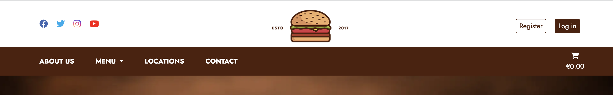
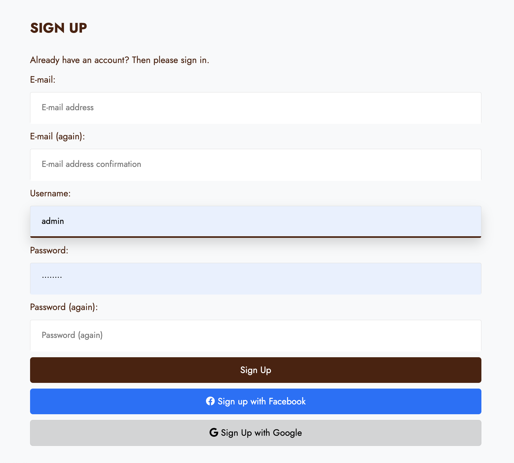
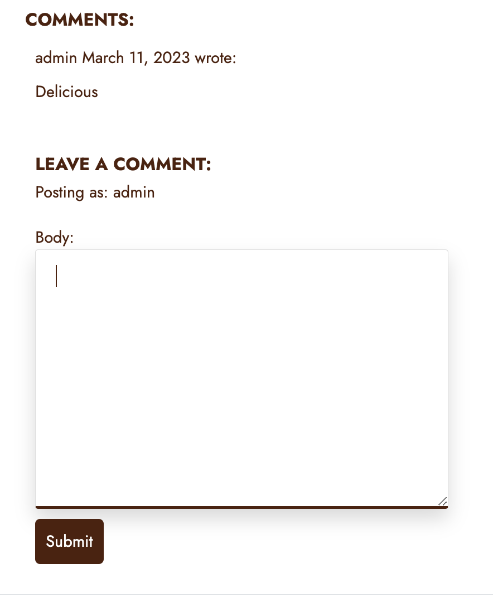
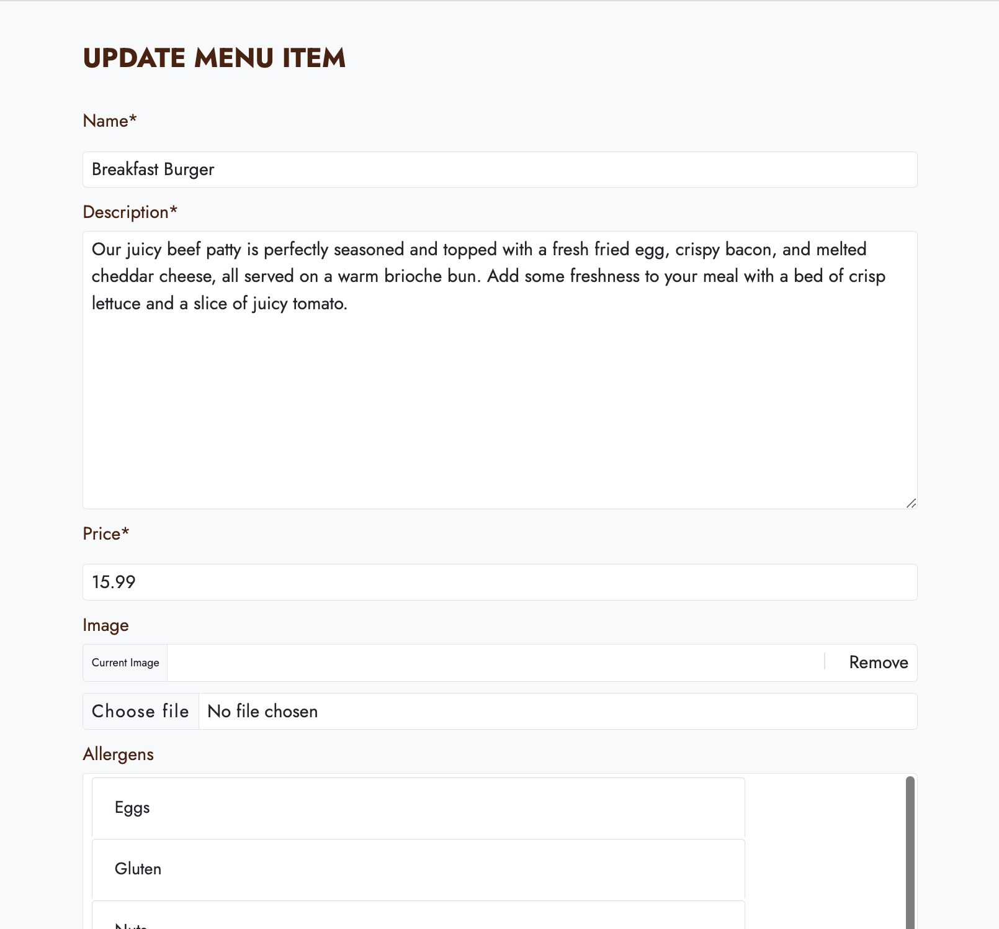
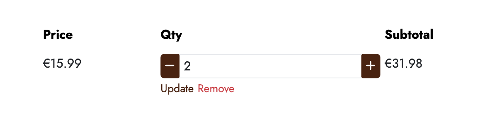
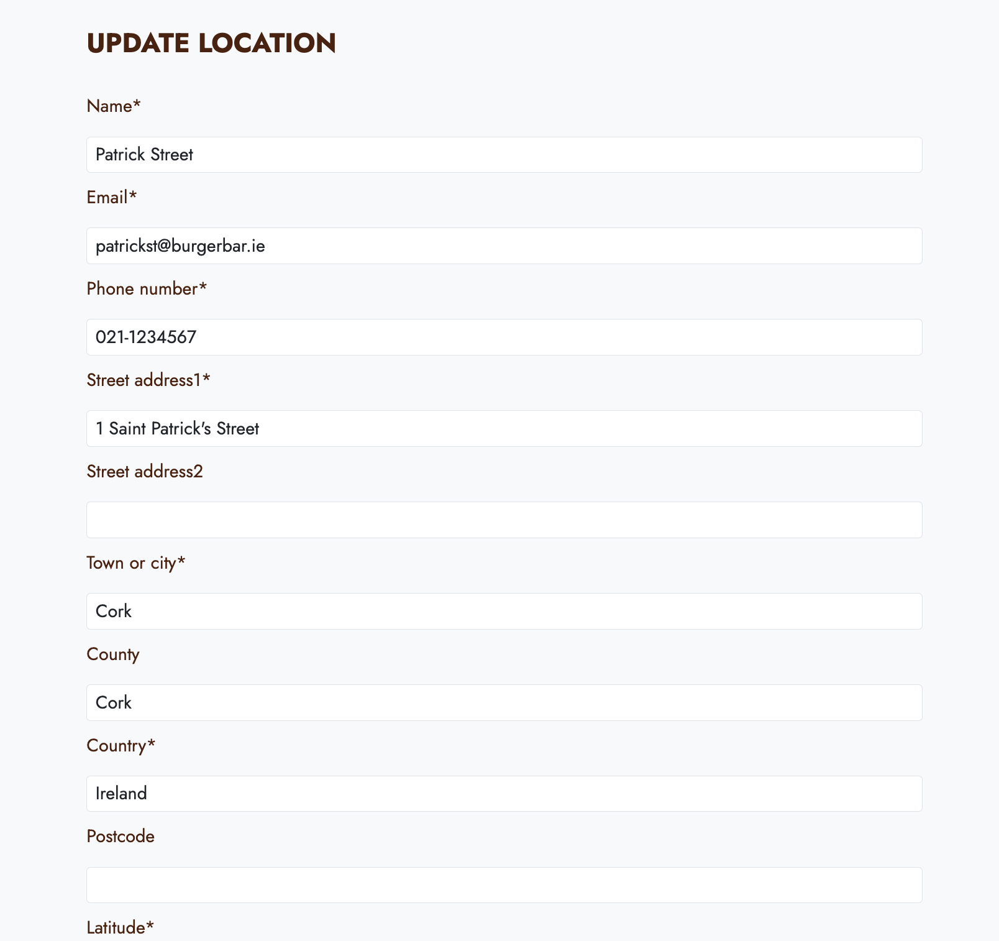
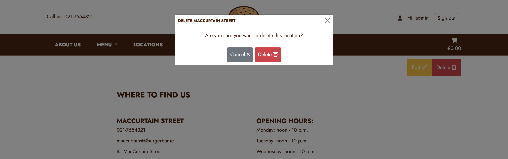
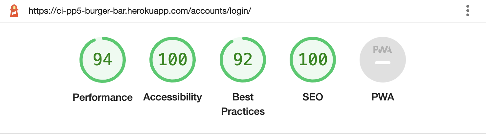

**Developer: John Constant**


💻 [Visit live website](https://ci-pp5-burger-bar.herokuapp.com/)

## Table of Contents
  - [About](#about)
  - [User Goals](#user-goals)
  - [Site Owner Goals](#site-owner-goals)
  - [User Experience](#user-experience)
  - [User Stories](#user-stories)
  - [Design](#design)
    - [Fonts](#fonts)
    - [Structure](#structure)
      - [Website pages](#website-pages)
      - [Database](#database)
    - [Wireframes](#wireframes)
  - [Technologies Used](#technologies-used)
  - [Features](#features)
  - [Validation](#validation)
  - [Testing](#testing)
    - [Manual testing of user stories](#manual-testing-of-user-stories)
    - [Automated testing](#automated-testing)
    - [Performing tests on various devices](#performing-tests-on-various-devices)
    - [Browser compatibility](#browser-compatibility)
  - [Bugs](#bugs)
  - [Configuration](#configuration)
    - [Google emails](#google-emails)
    - [Forking the GitHub Repository](#forking-the-github-repository)
    - [Making a Local Clone](#making-a-local-clone)
  - [Credits](#credits)
  - [Acknowledgements](#acknowledgements)

### Credentials

### About

Burger Bar is a fast-food restaurant that specializes in serving high-quality burgers, fries, and other classic American fast-food favorites. Located in the heart of bustling downtown, we cater to busy professionals and college students who are looking for a quick and satisfying meal on the go.

Our menu features a variety of burgers made from fresh, never frozen, 100% Angus beef patties cooked to order. Customers can choose from classic options like the Cheeseburger or Double Cheeseburger. In addition to burgers, we also offer a selection of sides such as crispy fries, onion rings, and sweet potato fries. For those who are looking for something lighter, we have a range of salads and vegetarian options on the menu as well.

At Burger Bar, we believe in using the freshest ingredients and maintaining high standards of quality and cleanliness. Our team is committed to providing exceptional customer service and ensuring that every customer leaves satisfied.

Whether you're in a rush or looking for a quick bite to eat, Burger Bar has you covered with delicious, high-quality fast food that you can feel good about.

### User Goals

- To get information on the restaurant I may visit
- To view the menu with item descriptions, images and prices
- To place an online order for delivery or collection at my nearest restaurant
- To keep up to date with special offers and new products
- To comment on past orders and give general feedback to the restaurant 
- To create an account for easy checkout of future purchases

### Admin user Goals
- To create, update and delete all menu items
- To create recipes and update and delete restaurant locations
- To create, update and delete frequently asked questions
- To be able to view user profiles
- To be able to read and react to user comments and feedback

### Site Owner Goals

- Provide an online solution for customers to place orders for their food
- Create visually appealing design
- Provide fully responsive application with straightforward navigation
- Provide customers with a platform to connect by email or social media
- To appear as high as possible within the Google search rankings


## User Experience

### Target Audience
- People who want to get their food in a hurry upon collection or have their food delivered straight to their door
- Customers who may not know exactly what they are looking to eat
- People looking to connect with our restaurant via email or social media

### User Requirements and Expectations

- Straightforward navigation
- Easy to use
- A responsive application that allows the customer to access company information at ease
- Visually appealing design for all screen sizes
- Links and functions that work as expected
- An easy way to contact the restaurant
- Accessibility

##### Back to [top](#table-of-contents)


## User Stories

### Site User
1. As a site user, I want a clean and easy to use menu for intuitive navigation through the site.
2. As a site user, I want to be able to connect with social media to stay up-to-date with new offers.
3. As a site user, I want to be able to connect by email to stay up-to-date with new offers.
4. As a site user, I want to see the most important company information on initially arriving at the website.
5. As a site user, I want to be able to find out more about the company to help make an informed decision about who I purchase from.
6. As a site user, I want to be able to view the restaurant’s menu to see what items are on offer.
7. As a site user, I want to be able to sort menu products by price, category and alphabetically to easily find what I’m looking for.
8. As a site user, I want to be able to search the menu for items I want.
9. As a site user, I want to be able to place an order for collection or delivery.
10. As a site user, I want to be able to choose the amount of an item I want to add to my order.
11. As a site user I want to be able to see which items are suitable for me based on my food allergies.
12. As a site user, I want to be able to review my order before checking out to ensure it is correct.
13. As a site user, I want to be able to update my order before checking out.
14. As a site user, I want to check out through a secure checkout form.
15. As a site user, I want my profile details prepopulated in checkout form when signed into the website.
16. As a site user, I want to be able to view my previous orders.
17. As a site user, I want to be able to leave feedback about my order.
18. As a site user, I want to be able to view information about the various restaurant locations.
19. As a site user, I want to be able to view the restaurant’s FAQs to answer some common questions I may have.
20. As a site user, I want to be able to contact the restaurant with any questions or comments I may have.
21. As a site user, I want to be able to create an account and save my personal information.
22. As a site user, I want to be able to create an account using my social media for quick setup.
23. As a site user, I want to be able to update my account information.

### Site Administrator
24. As a site administrator, I want to be able to add, edit and delete menu items and menu categories
25. As a site administrator, I want to be able to add, edit and delete new locations when new restaurants open.
26. As a site administrator, I want to be able to add, edit and delete a new FAQ
27. As a site administrator, I want to view the users registered to the website.
28. As a site administrator, I want to be able to view comments and messages left by users on the Contact Us form
29. As a site administrator, I want to be able to to add new allergens
30. As a site administrator, I want to be able to to add new menu categories
31. As a site administrator, I want to be able to to view and edit past orders

### Store Owner
32. As a store owner, I want to increase the number of social media fans I have.
33. As a store owner, I want to increase the number of people I can email about new products and special offers to increase foot traffic in the restaurants.
34. As a store owner, I want the highest possible ranking in the Google search results (SEO best practices).
35. As a store owner, I want to be able to add new locations to the site as they open increasing sales.
36. As a store owner, I need to be able to view the number of registered customers by store.
37. As a store owner, I want to be able to add new FAQs to cut down on the number of customer queries
38. As a store owner, I want to be sure all payment are processed even if the site connection is disturbed during the checkout process.
39. As a store owner, I want to make the checkout process as easy as possible for customers to increase the number of orders.
40. As a store owner, I want customers to create accounts so I can store information on customers for marketing purposes.

##### Back to [top](#table-of-contents)


## Design

### Fonts

Google Fonts were implemented on the website. Jost with sans-serif as fallback was used thoughout the site to present the content in a clear and legible way for the body content. Kaushan Script with a cursive fallback was used for the main page headings.

### Structure

#### Website pages

Simplicity, clarity and ease of navigation between pages were the key aspects for design of this website's structure.

At the top of the page there is a recognisable type of navigation bar with website logo in the centre and the authentication links to the right of it. The navigation bar also contains links to the company's social media sites unless there is a defualt location saved in the user's profile. If a default location is saved to the customer's profile, the locations phone number is displayed instead. 

The navigation also contains a sub-navigation menu with links to the most important web pages. This menu collapses to hamburger icon on smaller screen sizes. At the bottom of the page there is a footer with links to social media pages(opening in a separate tab/window).

- The website consists of the following sections:
  - Home page with an overview of the content and aim of the website.
  - About us page where the user can gain a more in-depth profile of the company and our values.
  - Menu page with information on each menu item including name, description and price.
  - Menu item detail page with additional item information such as allergen info and ability to add item to customer's order.
  - Locations page listing the individual restaurants.
  - Location detail page with information such as contact info, address, opening hours and location on map.
  - FAQs page listing some of the most frequently asked question and answers.
  - Shopping Cart page where users can view the items and cost of their current order.
  - Checkout page where can enter their order info and securely pay for their order.
  - Checkout Success page where customers gain a summary of their order after paying for it.
  - Profile page where customers can view and update their profile and view past orders.
  - Order history page where customers can view information about a past order and leave feedback on the specific order.
  - Add menu item page allowing admin user to create a menu item.
  - Edit menu item page where admin user can edit an existing menu item.
  - Delete menu item allowing admin user to delete selected menu item.
  - Add location page allowing admin user to create a location.
  - Edit location page where admin user can edit an existing location.
  - Delete location allowing admin user to delete selected location.
  - Add FAQ page allowing admin user to create a FAQ.
  - Edit FAQ page where admin user can edit an existing FAQ.
  - Delete FAQ allowing admin user to delete selected FAQ.
  - Login page for returning user to log in by email or social provider.
  - Register page allowing a new user to sign up by email or social provider.
  - Logout page allowing user to log out of the website.
  - Contact page with contact form which allows users to provide their feedback.
  - 400, 403, 404 & 500 error page.

#### Database

- The backend consists of Python built with the Django framework with a database of a Postgres for the deployed version
- Two database models contain all fields stored in the database and mimics the structure of what is actually stored in the Postgres database

<details><summary>Show diagram</summary>

</details>

The following models were created to represent the database model structure for the website:

##### User Model
- The User model contains information about the user. It is part of the Django allauth library

##### Category Model
- The Category model contains the following fields: title, description, featured_image and Recipe
- The model has a many-to-many relationship with Recipe

##### Recipe Model
- The Recipe model represents a specific recipe and contains its general information
- The Recipe model contains the following fields: title, description, featured image, categories, servings, prep time, cook time, difficulty, author, status, created date, last modified date, ingredients and instructions
- The model has a many-to-many relationship with Category
- It contains Ingredient as a foreign key
- It contains Instruction as a foreign key

##### Ingredient Model
- The Ingredient model represents an ingredinet for a specific recipe's ingredients
- The Ingredient model contains the following fields: name, amount, notes and recipe
- It contains Recipe as a foreign key

##### Instruction Model
- The Instruction model represents an instruction for a specific recipe's instructions
- The Instruction model contains the following fields: body and recipe
- It contains Recipe as a foreign key

##### Comment Model (Recipe)
- The Comment model represents a comment on a specific recipe
- The Comment model contains the following fields: name, email, body, created_date, approved and recipe
- It contains Recipe as a foreign key

##### Article Model
- The Article model represents a specific article and contains its general information
- The Article model contains the following fields: title, description, featured image, author, status, created date and last modified date.

### Wireframes

<details><summary>Home page</summary>

</details>
<details><summary>Categories page</summary>

</details>
<details><summary>Category detail page</summary>

</details>
<details><summary>Recipes page</summary>

</details>
<details><summary>Recipe detail page</summary>

</details>
<details><summary>Articles page</summary>

</details>
<details><summary>Article detail page</summary>

</details>
<details><summary>Contact page</summary>

</details>

## Technologies Used

### Languages & Frameworks

- HTML
- CSS
- Javascript
- Python 3.8.11
- Django 3.2.16


### Libraries & Tools

- [Am I Responsive](http://ami.responsivedesign.is/) was used to create the multi-device mock-up at the top of this README.md file
- [Balsamiq](https://balsamiq.com/) to create the projects wireframes
- [Bootstrap v5.2.3](https://getbootstrap.com/). This project uses the Bootstrap library for UI components (Buttons, Card, Footer, Modal, Pagination, Navbar)
- [Cloudinary](https://cloudinary.com/) to store static files
- [Dbdiagram.io](https://dbdiagram.io/home) used for the database schema diagram
- [Favicon.io](https://favicon.io) for making the site favicon
- [Chrome dev tools](https://developers.google.com/web/tools/chrome-devtools/) was used for debugging of the code and checking site for responsiveness
- [Font Awesome](https://fontawesome.com/) - Icons from Font Awesome were used throughout the site
- [Git](https://git-scm.com/) was used for version control within VSCode to push the code to GitHub
- [GitHub](https://github.com/) was used as a remote repository to store project code
- [Google Fonts](https://fonts.google.com/)
- [Heroku](https://heroku.com) was used to deploy the project into live environment
- [jQuery](https://jquery.com) was used for drop-down exercises filters on smaller screens
- [Elephant SQL](https://www.elephantsql.com/) – deployed project on Heroku uses an Elephant SQL database
- [Summernote](https://summernote.org/) - editor used for exercise description field in Admin page
- [Visual Studio Code (VSCode)](https://code.visualstudio.com/) - code editor used to write this project
- Validation:
  - [WC3 Validator](https://validator.w3.org/) was used to validate the html in the project
  - [Jigsaw W3 Validator](https://jigsaw.w3.org/css-validator/) to validate the css in the project
  - [JShint](https://jshint.com/) for JavaScript quality
  - [Lighthouse](https://developers.google.com/web/tools/lighthouse/) for performance, accessibility, progressive web apps, SEO analysis of the project code
  - [Wave Validator](https://wave.webaim.org/) to evaluate accessibility

##### Back to [top](#table-of-contents)


## Features

### Logo and Navigation Bar
- Featured and consistent on the all pages
- The top-nav bar contains the comapny logo and links to for customers to register or sign in.
  - Logged-in users will see their name in the nav bar with option on click to either view their profile or log out
  - Logged-in users with a default location saved to their profile will see the phone number of their default restaurant location.
- The sub-nav bar contains links to Home page, About Us page, Menu page, Locations page and Contact Us page.
- The nav bar is fully responsive and changes to a toggler (hamburger menu) on smaller size screens
- The navbar allows user to easily jump to a specific section on the website
- User stories covered: 2, 18

<details><summary>See feature images</summary>





</details>


### Home page
- Home page includes nav bar, main body and a footer
- Home page main body includes the featured recipes section, a description of the website and what its users can find and expect, the most popular recipes section, most recent categories section, most recent articles section and sign up form. 
- User stories covered: 1

<details><summary>See feature images</summary>


</details>


### Footer
- A footer is displayed at the bottom of the each page
- Contains links to social media sites (opening in a separate window)
- Contains links to the FAQ page, privacy policy, contact us and sitemap pages
- User stories covered: 16

<details><summary>See feature images</summary>


</details>


### Sign up / Register
- New users can create an account
- The user must provide a valid username, password and password confirmation. Email address is optional
- Users can register for an account with Google and Facebook social sign on
- User cannot register the same details twice for an account
- Once register the users are immediately logged in and taken to the home page
- User stories covered: 3, 14

<details><summary>See feature images</summary>




</details>


### Login
- Returning users can login to their account
- The user must have an account in the system and they must enter the correct username and password
- Users can sign in to there account with Google and Facebook social sign on
- Both fields are mandatory
- Once logged in the user will be navigated to the planner page
- User stories covered: 10, 12, 14

<details><summary>See feature images</summary>


</details>


### Logout
- Confirmation screen for Logged in user to logout from their account 
- User stories covered: 21

<details><summary>See feature images</summary>


</details>


### Profile page
- The Profile page contains a list of the details saved to the customer's personal profile.
- This list contains their default restaurant, personal info and delivery information.
- Customers can edit the information on their profile by updating this form.
- Customers can also view a list of their past orders on this page.
- User stories covered: 15

<details><summary>See feature images</summary>


</details>


### Order history page
- The Order history page contains a summary of the customer's order.
- The summary contains the customer's order and personal information as well as a short summary of the item's added to this order.
- The summary also display a message notifying the customer of an approximate delivery/collection time and that a confirmation email has been sent to the email supplied.
- Customers can leave a comment on an order once it has been placed on this page.
- User stories covered: 15

<details><summary>See feature images</summary>



</details>


### About Us
- The about us page contains a header image and some text describing the company's values. 
- User stories covered: 21

<details><summary>See feature images</summary>


</details>


### Menu page
- The menu page contains an image, name, description and price for each menu item.
- Customers can search this page by item name, as well as sort menu items alphabetically or by price.
- There are two views depending whether a user is logged in or not.
  - Users who are logged in as admins can see the option to add a menu item. 
  - Logged-in users and unauthenticated users will not have the ability to add menu items and therefore won't see this section of the page.
- User stories covered: 3, 10, 12
<details><summary>See feature images</summary>


</details>


### Menu Item detail page
- This page contains the featured image, name, description, price and allergen information where applicable.
- Quantity buttons are restricted to values between 1 and 99. They will appear greyed out otherwise.
- Checkout button appears on page if cart is not empty.
- There are two views depending whether a user is logged in or not
  - Users who are logged in as admins can see the option to edit or delete a menu item. 
  - Logged-in users and unauthenticated users will not have the ability to edit or delete menu items and therefore won't see this section of the page.
- User stories covered: 3, 10, 12
<details><summary>See feature images</summary>


</details>


### Add Menu Item page
- Logged in admin users have the ability to add menu items.
- Admin users will add a name, description, fetured image, price, category, allergens and choose whether to publish the menu item immediately or not.
- Admin users also have the ability to 'feature' a menu item which will add it to the home page.
- It is possible to leave some fields blank.
- For easier use on small screen devices the form increases to full screen width.
- User is provided with a feedback message that their menu item has been added.
- User stories covered: 4, 13
  
<details><summary>See feature images</summary>


</details>

### Edit Menu Item page
- Admin users can edit the information of any menu item.
- The Edit menu item page is based off of the Add menu item page.
- Fields are prepopulated with the information from the selected menu item.
- User is provided with a feedback message that their menu item has been updated.
- User stories covered: 4, 8

<details><summary>See feature images</summary>


</details>


### Deleting a Menu Item
- Located on the menu item detail page, admin users can delete existing menu items.
- Defensive programming principles applied by presenting user with a modal to confirm deletion.
- User is provided with a feedback message that their menu item has been deleted.
- User stories covered: 5, 6

<details><summary>See feature images</summary>


</details>


### Shopping Cart
- The Shopping Cart page contains a summary of the items added to the customer's order.
- The summary contains individual item's images, names, quantities, and total price.
- Customers can update the quantity of an item on this page or remove an item from their order should they choose.
- The Shopping Cart page also contains a summary of the order cost, delivery cost and a message letting the customer know how much more they need to spend to avail of our free delivery offer.
- User stories covered: 15

<details><summary>See feature images</summary>




</details>


### Checkout
- The Checkpout page contains a summary of the items added to the customer's order.
- The summary contains individual item's images, names, quantities, and total price.
- The Shopping Cart page also contains a summary of the order cost and delivery cost.
- This page contains a form for customer's to supply their order information, personal information and payment information.
- Information entered on this page can be saved to the customer's profile.
- Payments processed on this page are done securely through Stripe with a webhook handling orders where connection may drop before the process is completed.
- User stories covered: 15

<details><summary>See feature images</summary>


</details>


### Checkout Succss
- The Checkpout page contains a summary of the customer's order.
- The summary contains the customer's order and personal information as well as a short summary of the item's added to this order.
- The summary also display a message notifying the customer of an approximate delivery/collection time and that a confirmation email has been sent to the email supplied.
- User stories covered: 15

<details><summary>See feature images</summary>


</details>


### Locations page
- The locations page contains a link to the location detail page for each of our restaurants.
- There are two views depending whether a user is logged in or not.
  - Users who are logged in as admins can see the option to add a new location. 
  - Logged-in users and unauthenticated users will not have the ability to add locations and therefore won't see this section of the page.
- User stories covered: 3, 10, 12
<details><summary>See feature images</summary>


</details>


### Location detail page
- This page contains the name, contact information, opening hours and map co-ordinates for each location.
- There are two views depending whether a user is logged in or not
  - Users who are logged in as admins can see the option to edit or delete a location. 
  - Logged-in users and unauthenticated users will not have the ability to edit or delete locations and therefore won't see this section of the page.
- User stories covered: 3, 10, 12
<details><summary>See feature images</summary>


</details>


### Add Location page
- Logged in admin users have the ability to add locations.
- Admin users will add a name, address, phone number, email, opening hours and GPS co-ordinates where applicable for the new location.
- It is possible to leave some fields blank.
- For easier use on small screen devices the form increases to full screen width.
- User is provided with a feedback message that their location has been added.
- User stories covered: 4, 13
  
<details><summary>See feature images</summary>


</details>

### Edit Location page
- Admin users can edit the information of any location.
- The Edit location page is based off of the Add location page.
- Fields are prepopulated with the information from the selected location.
- User is provided with a feedback message that their location has been updated.
- User stories covered: 4, 8

<details><summary>See feature images</summary>


</details>


### Deleting a location
- Located on the location detail page, admin users can delete existing locations.
- Defensive programming principles applied by presenting user with a modal to confirm deletion.
- User is provided with a feedback message that their location has been deleted.
- User stories covered: 5, 6

<details><summary>See feature images</summary>


</details>


### FAQ page
- The FAQ page contains a list of the most commonly asked questions in attempt to give the customer as much relevant information as they may need.
- There are two views depending whether a user is logged in or not.
  - Users who are logged in as admins can see the option to add a new FAQ and they will also see edit and delete buttons alongside each FAQ. 
  - Logged-in users and unauthenticated users will not have the ability to add, edit or delete FAQs and therefore won't see this section of the page.
- User stories covered: 3, 10, 12
<details><summary>See feature images</summary>


</details>

### Add FAQ page
- Logged in admin users have the ability to add FAQs.
- Admin users will add a question and answer.
- It is not possible to leave some fields blank.
- For easier use on small screen devices the form increases to full screen width.
- User is provided with a feedback message that their FAQ has been added.
- User stories covered: 4, 13
  
<details><summary>See feature images</summary>


</details>

### Edit FAQ page
- Admin users can edit the information of any FAQ.
- The Edit FAQ page is based off of the Add FAQ page.
- Fields are prepopulated with the information from the selected FAQ.
- User is provided with a feedback message that their FAQ has been updated.
- User stories covered: 4, 8

<details><summary>See feature images</summary>


</details>


### Deleting a FAQ
- Located on the FAQ page, admin users can delete existing FAQs.
- Defensive programming principles applied by presenting user with a modal to confirm deletion.
- User is provided with a feedback message that their FAQ has been deleted.
- User stories covered: 5, 6

<details><summary>See feature images</summary>


</details>


### Feedback messages
- User is provided with feedback message about the action their performed, eg. added, edited or deleted a plan or logged-in, registered, logged-out, etc.
- User stories covered: 7

<details><summary>See feature images</summary>


</details>


### Contact form
- Contact form allows user to contact the restaurant and send their message or provide feedback
- Customers are asked for name, email, message topic and message as well as optional email subscription
- Username on the form is automatically provided for the logged-in customers.
- User stories covered: 16

<details><summary>See feature images</summary>


</details>


### Error pages
- If a user encounters an error, the relevant error page is displayed (400, 403, 404 or 500)
- User stories covered: 15

<details><summary>See feature images</summary>


</details>

##### Back to [top](#table-of-contents)


## Validation

The W3C Markup Validation Service was used to validate the HTML of the website.
<details><summary>Home</summary>

</details>

<details><summary>About Us</summary>

</details>

<details><summary>Menu</summary>

</details>

<details><summary>Menu Detail</summary>

</details>

<details><summary>Locations</summary>
 
</details>

<details><summary>Location Detail</summary>

</details>

<details><summary>FAQs</summary>
 
</details>

<details><summary>Cart</summary>
 
</details>

<details><summary>Checkout Success</summary>
 
</details>

<details><summary>Profile</summary>
 
</details>

<details><summary>Order History</summary>
 
</details>

<details><summary>Contact</summary>

</details>

<details><summary>Login</summary>

</details>

<details><summary>Signup</summary>

</details>

<details><summary>Logout</summary>

</details>

<details><summary>Error Pages (400, 403, 404, 500)</summary>
 
</details>


### CSS Validation
The W3C Jigsaw CSS Validation Service was used to validate the CSS of the website. When validating all website, it passes with no errors.

<details><summary>Style.css</summary>

</details>

### JavaScript Validation
JSHint JS Validation Service was used to validate the Javascript files. No errors were found.

<details><summary>Script.js</summary>

</details>

### PEP8 Validation
PEP8 Validation Service was used to check the code for PEP8 requirements. All the code passes with no errors and no warnings to show.

All python files are pep8 compliant except for settings.py which has 5 issues. Files were checked using the pycodestyle python package.

<details><summary>Validation</summary>

</details>


### Wave
The WAVE WebAIM web accessibility evaluation tool was used to test the website's accessibility.

<details><summary>Home</summary>

</details>

<details><summary>About Us</summary>

</details>

<details><summary>Menu</summary>

</details>

<details><summary>Menu Detail</summary>

</details>

<details><summary>Locations</summary>
 
</details>

<details><summary>Location Detail</summary>

</details>

<details><summary>FAQs</summary>
 
</details>

<details><summary>Cart</summary>
 
</details>

<details><summary>Contact</summary>

</details>

<details><summary>Login</summary>

</details>

<details><summary>Signup</summary>

</details>

<details><summary>Error Pages (400, 403, 404, 500)</summary>
 
</details>

##### Back to [top](#table-of-contents)

### Lighthouse Performance
The Lighthouse evaluation tool was used to test the website's performance.

<details><summary>Home</summary>

</details>

<details><summary>About Us</summary>

</details>

<details><summary>Menu</summary>

</details>

<details><summary>Menu Detail</summary>

</details>

<details><summary>Locations</summary>
 
</details>

<details><summary>Location Detail</summary>

</details>

<details><summary>FAQs</summary>
 
</details>

<details><summary>Cart</summary>
 
</details>

<details><summary>Contact</summary>

</details>

<details><summary>Login</summary>

</details>

<details><summary>Signup</summary>

</details>

<details><summary>Log out</summary>

</details>

<details><summary>Error Pages (400, 403, 404, 500)</summary>
 
</details>

##### Back to [top](#table-of-contents)

## Testing

The testing approach is as follows:
1. Manual testing of user stories
2. Automated testing

### Manual testing of user stories

### Users
1. I want to see the home page with explanation of the app

**Step** | **Expected Result** | **Actual Result**
------------ | ------------ | ------------ |
Navigate to https://ci-pp4-recipe-site.herokuapp.com/ | Home page main body loads with application description | Works as expected |

<details><summary>Screenshot</summary>

</details>


2. As a site user, I can create an account to interact with recipes

**Step** | **Expected Result** | **Actual Result**
------------ | ------------ | ------------ |
Navigate to https://ci-pp4-recipe-site.herokuapp.com/accounts/signup/ and fill submit form | account is created for the user with the submitted details | Works as expected |
Navigate to https://ci-pp4-recipe-site.herokuapp.com/accounts/signup/ and click sign up with Google button | account is created for the user with details from Google account | Works as expected |
Navigate to https://ci-pp4-recipe-site.herokuapp.com/accounts/signup/ and click sign up with Facebook button | account is created for the user with details from Facebook account | Works as expected |

<details><summary>Screenshot</summary>


</details>

3. As a site user, I can view all recipes in one place

**Step** | **Expected Result** | **Actual Result**
------------ | ------------ | ------------ |
Navigate to https://ci-pp4-recipe-site.herokuapp.com//recipes/ | Recipes page main body loads with all recipes displayed | Works as expected |

<details><summary>Screenshot</summary>


</details>


4. As a site user, I can view the most popular recipes on the home page

**Step** | **Expected Result** | **Actual Result**
------------ | ------------ | ------------ |
Navigate to https://ci-pp4-recipe-site.herokuapp.com// and scroll to most popular recipes section | Recipes with likes appear in three panels on homepage | Works as expected |
Click on most popular panel | Brought to recipe detail page for more information on recipe | Works as expected |

<details><summary>Screenshot</summary>

</details>


5. As a site user, I can view the featured recipes on the home page

**Step** | **Expected Result** | **Actual Result**
------------ | ------------ | ------------ |
Navigate to https://ci-pp4-recipe-site.herokuapp.com// | 5 featured recipes appearing on homepage carousel | Works as expected |
Click on most carousel slide | Brought to recipe detail page for more information on recipe | Works as expected |

<details><summary>Screenshot</summary>


</details>


6. As a site user, I can log in to comment on recipes and articles

**Step** | **Expected Result** | **Actual Result**
------------ | ------------ | ------------ |
Navigate to https://ci-pp4-recipe-site.herokuapp.com/accounts/login/ and fill submit form | account is created for the user with the submitted details | Works as expected |
Navigate to https://ci-pp4-recipe-site.herokuapp.com/accounts/login/ and click log in with Google button | account is created for the user with details from Google account | Works as expected |
Navigate to https://ci-pp4-recipe-site.herokuapp.com/accounts/login/ and click log in with Github button | account is created for the user with details from Github account | Works as expected |
Once logged in go to recipe page, scroll to comments section and leave a comment | Comment is submitted for approval | Works as expected

<details><summary>Screenshot</summary>


</details>


7. As a site user, I can log in to like/unlike recipes

**Step** | **Expected Result** | **Actual Result**
------------ | ------------ | ------------ |
Navigate to https://ci-pp4-recipe-site.herokuapp.com/accounts/login/ and fill submit form | account is created for the user with the submitted details | Works as expected |
Navigate to https://ci-pp4-recipe-site.herokuapp.com/accounts/login/ and click log in with Google button | account is created for the user with details from Google account | Works as expected |
Navigate to https://ci-pp4-recipe-site.herokuapp.com/accounts/login/ and click log in with Facebook button | account is created for the user with details from Facebook account | Works as expected |
Once logged in go to recipe page, scroll to info section and click heart icon | Icon changes to solid heart and number of likes count increases by one | Works as expected

<details><summary>Screenshot</summary>


</details>


8. As a site user, I can log in using social media accounts/gmail to make registration easier

**Step** | **Expected Result** | **Actual Result**
------------ | ------------ | ------------ |
Navigate to https://ci-pp4-recipe-site.herokuapp.com/accounts/login/ and click log in with Google button | account is created for the user with details from Google account | Works as expected |
Navigate to https://ci-pp4-recipe-site.herokuapp.com/accounts/login/ and click log in with Facebook button | account is created for the user with details from Facebook account | Works as expected |

<details><summary>Screenshot</summary>


</details>

9. As a site user, I can view recipes organised by category to make finding particular recipes

**Step** | **Expected Result** | **Actual Result**
------------ | ------------ | ------------ |
Navigate to https://ci-pp4-recipe-site.herokuapp.com//categories/ | Category page loads | Works as expected |
Click on category panel tile for category detail page | Category detail page loads with related recipes displayed at the bottom of the page | Works as expected |

<details><summary>Screenshot</summary>


</details>

10. As a site user, I can view and leave comments on an individual recipe or article

**Step** | **Expected Result** | **Actual Result**
------------ | ------------ | ------------ |
Navigate to https://ci-pp4-recipe-site.herokuapp.com//recipes/ | Recipe page loads | Works as expected |
Click on recipe card for more information | Recipe detail page loads with comments section at the bottom of the page | Works as expected |
Logged in users can fill out the comment form and click submit button | Comment is submitted for approval | Works as expected |
Admin user approves comment in admin dashboard | Approved comments are displayed on the recipes page | Works as expected |

<details><summary>Screenshot</summary>


</details>

11. As a site user, I want to be aware of logged in status

**Step** | **Expected Result** | **Actual Result**
------------ | ------------ | ------------ |
Navigate to any page and check nav bar | Logged in users see welcome message with personalised username and sign out link | Works as expected |
Navigate to any page and check nav bar | Unauthenticated users see welcome message with register and sign in links | Works as expected |

<details><summary>Screenshot</summary>


</details>

12. As a site user, I want contact form/email subscription prefilled with account info

**Step** | **Expected Result** | **Actual Result**
------------ | ------------ | ------------ |
Navigate to https://ci-pp4-recipe-site.herokuapp.com/contact | Logged in users see username field of form prepopulated | Works as expected |

<details><summary>Screenshot</summary>


</details>

13. As a site user, I want to be able to search through the recipes, categories and articles

**Step** | **Expected Result** | **Actual Result**
------------ | ------------ | ------------ |
Click on search bar in navbar and enter search term | Search results are displayed on resulting page | Works as expected |

<details><summary>Screenshot</summary>


</details>

### Site admin
14. As a site admin, I can create, read, update and delete my recipes and articles to manage site content

**Step** | **Expected Result** | **Actual Result**
------------ | ------------ | ------------ |
Navigate to https://ci-pp4-recipe-site.herokuapp.com/admin logged in as superuser | Admin dashboard is displayed | Works as expected |
Click on Recipe add + button | Recipe add form is presented to user in backend | Works as expected |
Fill out form with relevant details and click save | New recipe is added to database | Works as expected |
Navigate to https://ci-pp4-recipe-site.herokuapp.com/recipes logged in as superuser | Add recipe button is displayed above recipe list | Works as expected |
Click on Recipe add + button | Recipe add form is presented to user in frontend | Works as expected |
Fill out form with relevant details and click save | New recipe is added to database | Works as expected |
Navigate to https://ci-pp4-recipe-site.herokuapp.com/admin logged in as superuser | Admin dashboard is displayed | Works as expected |
Click on Article add + button | Article add form is presented to user in backend | Works as expected |
Fill out form with relevant details and click save | New article is added to database | Works as expected |
Navigate to https://ci-pp4-recipe-site.herokuapp.com/articles logged in as superuser | Add article button is displayed above article list | Works as expected |
Click on Article add + button | Article add form is presented to user in frontend | Works as expected |
Fill out form with relevant details and click save | New article is added to database | Works as expected |

<details><summary>Screenshot</summary>


</details>

15. As a site admin, I can approve or disapprove comments so that I can filter out objectionable comments

**Step** | **Expected Result** | **Actual Result**
------------ | ------------ | ------------ |
Navigate to https://ci-pp4-recipe-site.herokuapp.com/admin logged in as superuser | Admin dashboard is displayed | Works as expected |
Click on Comments table | A list of all comments is displayed | Works as expected |
Select the commetns for approval from list and approve | Approved comments are displayed on the front end of the website | Works as expected |

<details><summary>Screenshot</summary>


</details>

16. As a site admin, I can create, read, update and delete categories to organise site content

**Step** | **Expected Result** | **Actual Result**
------------ | ------------ | ------------ |
Navigate to https://ci-pp4-recipe-site.herokuapp.com/admin logged in as superuser | Admin dashboard is displayed | Works as expected |
Click on Category add + button | Category add form is presented to user in backend | Works as expected |
Fill out form with relevant details and click save | New category is added to database | Works as expected |
Navigate to https://ci-pp4-recipe-site.herokuapp.com/categories logged in as superuser | Add category button is displayed above category list | Works as expected |
Click on Category add + button | Category add form is presented to user in frontend | Works as expected |
Fill out form with relevant details and click save | New category is added to database | Works as expected |

<details><summary>Screenshot</summary>


</details>

17. As a site admin, I can choose which recipes are featured on the home page

Navigate to https://ci-pp4-recipe-site.herokuapp.com/admin logged in as superuser | Admin dashboard is displayed | Works as expected |
Choose your recipe from the Recipes table | Recipe edit form is presented to user in backend | Works as expected |
Select the featured recipe checkbox and click save | New recipe is appearing on the home page carousel | Works as expected |
Navigate to https://ci-pp4-recipe-site.herokuapp.com/recipes logged in as superuser | Add recipe button is displayed above recipe list | Works as expected |
Choose your recipe from the Recipes table | Recipe edit form is presented to user in frontend | Works as expected |
Select the featured recipe checkbox and click save | New recipe is appearing on the home page carousel | Works as expected |


<details><summary>Screenshot</summary>


</details>

18. As a site admin, I want to be able to log into admin dashboard to edit recipes/categories/comments

Navigate to https://ci-pp4-recipe-site.herokuapp.com/admin | Admin sign in form is displayed | Works as expected |
Once logged in Recipes, Categories and articles tables are available | App tables are displayed | Works as expected |

<details><summary>Screenshot</summary>


</details>

19. As a site admin, I want edit forms prefilled with relevant info

**Step** | **Expected Result** | **Actual Result**
------------ | ------------ | ------------ |
Navigate to https://ci-pp4-recipe-site.herokuapp.com/admin logged in as superuser | Admin dashboard is displayed | Works as expected |
Choose a recipe from the Recipes table | Recipe edit form is presented with data prefilled | Works as expected |

Navigate to https://ci-pp4-recipe-site.herokuapp.com/recipes logged in as superuser | Choose recipe from list | Works as expected |
If logged in user is recipe author edit and delete buttons are available | Edit and Delete buttons are available to recipe author on recipe detail page | Works as expected |
Click on edit button | Recipe edit form is presented with data prefilled | Works as expected |

<details><summary>Screenshot</summary>


</details>

### Site Owner
20. As a site owner, I want to increase my social media presence

**Step** | **Expected Result** | **Actual Result**
------------ | ------------ | ------------ |
Navigate to the any page, scroll to bottom of page | Links bring user to social media page where they can follow restaurant | Works as expected |

<details><summary>Screenshot</summary>


</details>

21. As a site owner, I want data entry to be validated on sign-up page

22. As a site owner, I want the user to come to a 404 error page instead of having to use the browser back button if they enter a URL that does not exist

**Step** | **Expected Result** | **Actual Result**
------------ | ------------ | ------------ |
Type the wrong page in the www address | Reroute to a customised 404 page | Works as expected |

<details><summary>Screenshot</summary>

</details>

23. As a site owner, I want user to be able to contact me and provide their feedback

**Step** | **Expected Result** | **Actual Result**
Navigate to the contact page, scroll down to contact form | Form allows user to make contact and provide feedback | Works as expected |

<details><summary>Screenshot</summary>


</details>

### Automated testing

Automated testing was done using the Django's unit tests from a Python standard library module: unittest. 

### Performing tests on various devices

The website was tested using Google Chrome Developer Tools Toggle Device Toolbar to simulate viewports of different devices.

The website was tested on the following devices:
- MacBook Pro
- Dell on latest Windows OS
- Nord One Plus

### Browser compatibility

- Testing has been carried out on the following browsers:
  - Google Chrome
  - Safari
  - Firefox
  - Microsoft Edge
  - Android Native Browser
  - Google Chrome on Android


##### Back to [top](#table-of-contents)


## Bugs

| **Bug** | **Fix** |
| ------- | ------- |
| The post method on the RecipeUpdate class is not working correctly | Update RecipeUpdate to be function based view and use inline formset to update ingredients and instructions |
| Footer styling issues | Fix footer to bottom of pages |

## Future Considerations

| **Feature** | 
| ------- | 
| Fix Recipe Udate view | 
| Make Recipe form more dynamic by allowing user choose how many instruction and ingredient fields |


##### Back to [top](#table-of-contents)


## Configuration

### Forking the GitHub Repository
1. Go to the GitHub repository
2. Click on Fork button in top right corner
3. You will then have a copy of the repository in your own GitHub account.
   
### Making a Local Clone
1. Go to the GitHub repository 
2. Locate the Code button above the list of files and click it
3. Highlight the "HTTPS" button to clone with HTTPS and copy the link
4. Open commandline interface on your computer
5. Change the current working directory to the one where you want the cloned directory
6. Type git clone and paste the URL from the clipboard 
  ```
  $ git clone https://github.com/aleksandracodes/CI_PP4_Workout_Planner
  ```
7. Press Enter to create your local clone

##### Back to [top](#table-of-contents)


## Credits

### Images

**Images used in this app were found on Shutterstock and Envato. I'm not able to list all the sources but would like to emphasise that I'm not the author of any of them.**


### Code
- Django all-auth social sign on [tutorial](https://learndjango.com/tutorials/django-allauth-tutorial)
- Django all-auth [documentation](https://django-allauth.readthedocs.io/en/latest/index.html)
- [https://python.plainenglish.io/how-to-implement-pagination-in-django-with-function-based-views-8f6462554930]
- [https://stackoverflow.com/questions/60507625/django-wrong-amount-of-arguments-in-custom-handler]
- Instagram logo graident(https://stackoverflow.com/questions/37751375/instagram-new-logo-css-background)
- Gradient text(https://css-tricks.com/snippets/css/gradient-text/)

##### Back to [top](#table-of-contents)

## Acknowledgements

I would like to thank everyone who supported me in the development of this project:
- My mentor Mo for professional guidance and helpful feedback


